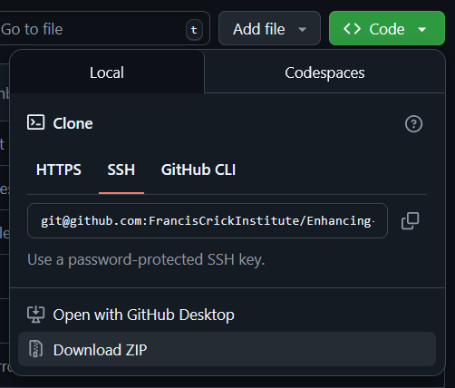
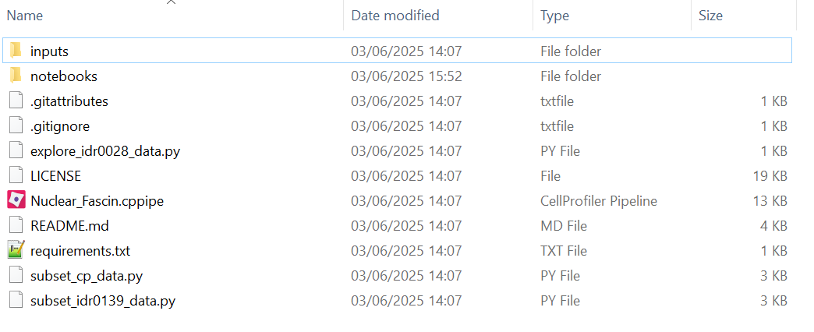

# Overview

[](https://mybinder.org/v2/gh/djpbarry/Enhancing-Reproducibility/main?urlpath=%2Fdoc%2Ftree%2Fnotebooks%2Fcompanion_notebook.ipynb) [](https://www.python.org/downloads/release/python-3130/)  

This repository contains the Python code associated with the following paper:

- Barry DJ, Marcotti S, Gerontogianni L and Kelly G (2025). Enhancing Reproducibility Through Bioimage Analysis: The Significance of Effect Sizes and Controls.

# Get Started

The quickest and easiest way to try this code is to [try it on Binder](https://mybinder.org/v2/gh/djpbarry/Enhancing-Reproducibility/main?urlpath=%2Fdoc%2Ftree%2Fnotebooks%2Fcompanion_notebook.ipynb). This will allow you to reproduce the plots in the associated publication.

# Run On Your Own Data

To test our code on your own data, the easiest thing to do is download this repo and run the [Nuclear_Fascin.cppipe](Nuclear_Fascin.cppipe) [CellProfiler](https://cellprofiler.org/) pipeline on your own images and replace the files in [the cell_profiler_outputs](inputs/cell_profiler_outputs) folder. You can then use the [Jupyter Notebook](notebooks/companion_notebook.ipynb) to generate plots for your own images.

A step-by-step guide is presented below. **You only need to perform steps 1 and 2 once.** Every subsequent time you want to run the code, skip straight to step 3.

## Step 1: Download the Contents of this Github Repo

### Easy Way - Follow these steps if you are not familiar with Git

Click on the small arrow on the green `Code` button above and then click `Download Zip`:


 
When the download completes, unzip the contents. You should now have a folder that looks like this:



Below, we will use the requirements file to set up a python environment to run the Jupyter notebooks contained in the `notebooks` folder.

### Harder Way

If you are already familiar with Git, you can obviously clone this repo like any other. However, some of the data in the `inputs` folder is quite large. As such, you will need to install [Git LFS](https://git-lfs.com/) to download the full dataset.

## Step 2: Install a Python Distribution

We recommend using conda as it's relatively straightforward and makes the management of different Python environments simple. You can install conda from [here](https://conda.io/projects/conda/en/latest/user-guide/install/index.html#regular-installation) (miniconda will suffice).

## Step 3: Organise Your Data

The [notebooks](./notebooks) in this repository will only work if your own data is stuctured in the same way as the [inputs](./inputs) in this repository. This assumes that the raw data has originated from the [Image Data Resource](https://idr.openmicroscopy.org/) and has a suitable annotations file associated with ([like this one](inputs/idr/idr0028-screenB-annotation.csv), for example). It is also assumed that the analysis of this raw data has been performed with [CellProfiler](https://cellprofiler.org/) using a pipeline similar to [Nuclear_Localisation.cppipe](Nuclear_Localisation.cppipe). It is certainly possible to adapt the notebooks to analyse data from other sources, but a reasonable knowledge of Python coding would be required to achieve this.

## Step 4: Set Up Environment

Once conda is installed, open Anaconda Prompt and run the following series of commands:

```
conda create --name enhancing-reproducibility pip
conda activate enhancing-reproducibility
python -m pip install -r <path to this repo>/requirements.txt
```
where you need to replace `<path to this repo>` with the location on your file system where you downloaded this repo. You will be presented with a list of packages to be downloaded and installed. The following prompt will appear:
```
Proceed ([y]/n)?
```
Hit Enter and all necessary packages will be downloaded and installed - this may take some time. When complete, you can deactivate the environment you have created with the following command.

```
conda deactivate
```
You have successfully set up the necessary conda environment!

## Step 5: Run The Code!

The following commands will launch a Jupyter notebook allowing you to run the code on your own data:
```
conda activate enhancing-reproducibility
jupyter notebook <path to this repo>/notebooks/companion_notebook.ipynb
```

The Jupyter Notebook should open in your browser - follow the step-by-step instructions in the notebook to run the code. If you are not familiar with Jupyter Notebooks, you can find a detailed introduction [here](https://jupyter-notebook.readthedocs.io/en/latest/notebook.html#introduction).
